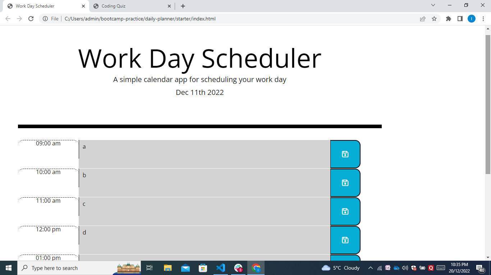

# day-planner

This is a coding day planner challenge using jQuery.

Link to deployed webpage: https://ify-jas.github.io/day-planner/

This week's challenge was to create a day planner app using jQuery and moment.js. This allowed me to use all that we have learnt so far in APIs most especially jQuery including setting up functions, loop and event listener. 

I found this particular assignment quite challenging as I had a lot more bugs than I envisioned while trying to insert the HTML tags using jQuery. This affected the functionality a lot and I had to revert to manual insertion of HTML tags on the index.html page. No doubt will get better with experience. I was able to complete the work by using functions to store my plans to the local storage then using a different function to call it and leave it displayed on the page.

Please find the screen shot below;

## Installation

CDNs Moment.js, jQuery, fontawesome.

## Usage

Not applicable for this project

## Credits

Ifeoma Ezeoke

## License

Please refer to the License in the repository.